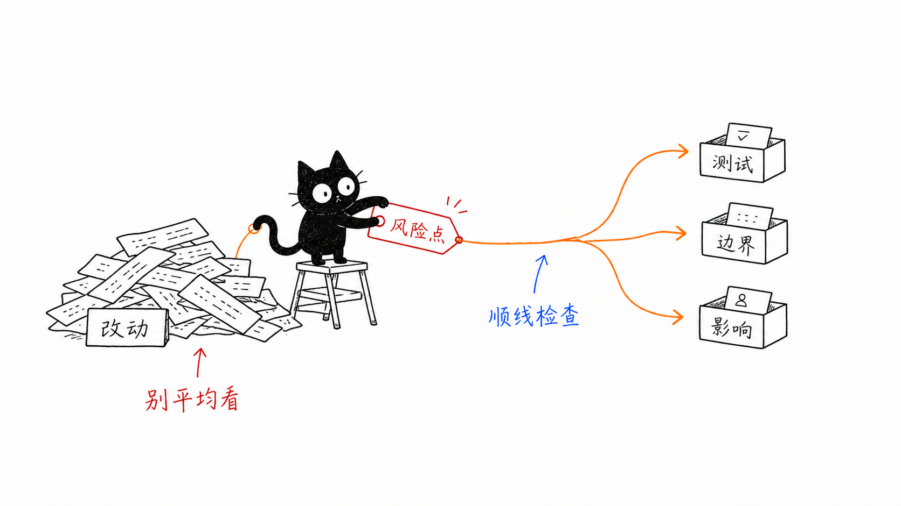
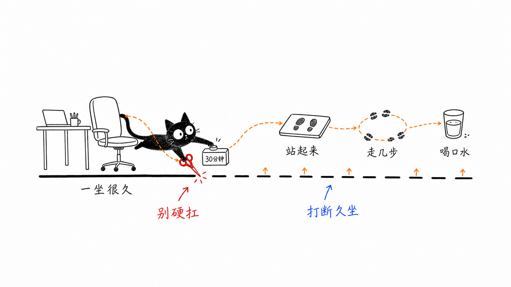
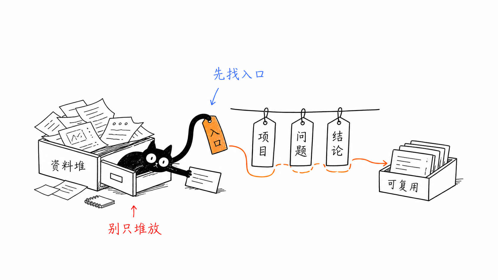
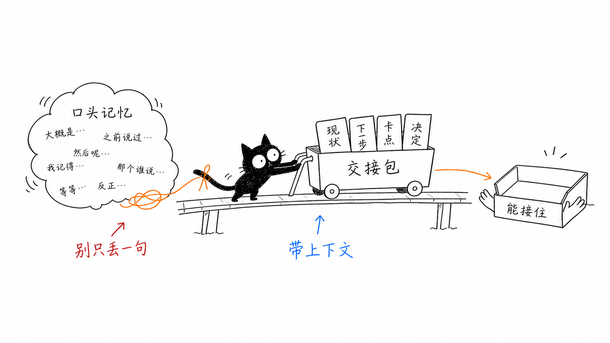

# Black Cat Illustrations

> 把中文文章里的判断、流程、状态和隐喻，变成一张张白底、手绘、怪诞但清爽的呆头黑猫正文配图。
>
> 16:9 横版 | 呆头黑猫 IP | 纯白手绘 | 少量红橙蓝中文批注 | Codex Skill

---

## 这个仓库是什么

Black Cat Illustrations 是一个 Codex Skill，用来指导 AI Agent 为中文文章、帖子、博客、Notion 文档和方法论内容生成正文配图。

它不是通用插画 prompt，也不是 PPT 信息图模板。它的核心目标是：先理解文章里的认知锚点，再把其中一个判断、流程、结构、状态或隐喻，变成一张有记忆点的 16:9 手绘解释图。

默认视觉 IP 是“呆头黑猫”：一个黑色身体、大白眼、小黑瞳、三角耳、少量乱线胡须、表情发懵的小比例角色。黑猫不是宠物头像，不是表情包贴纸，也不是站在角落里的装饰物，而是正在认真参与系统运转的荒诞工作者。

一句话：**让 AI 不只是“配一张图”，而是把文章里的一个关键认知动作，用一只小小的呆头黑猫画出来。**

---

## 与原项目的关系

本项目基于 [Ian Xiaohei Illustrations](https://github.com/helloianneo/ian-xiaohei-illustrations) 的结构、工作流和视觉方法进行设计创作。

原项目的核心是“小黑怪诞正文配图”：纯白背景、极简手绘、大量留白、少量红橙蓝中文批注、低科技隐喻，以及“角色必须参与核心动作”的生成逻辑。

Black Cat Illustrations 在这个基础上做了一个新的视觉 IP 变体：

- 保留原版的清爽手绘正文配图体系
- 保留“先理解文章，再设计认知锚点”的工作流
- 保留低科技隐喻、少字、留白、非 PPT 感
- 将固定角色从“小黑”替换为“小比例呆头黑猫”
- 限制黑猫占比，避免变成黑猫头像、宠物贴纸或插画海报

本项目同样采用 MIT License。原项目作者与许可信息请见原仓库；本仓库的再设计内容也以 MIT License 发布。

---

## 适合谁用

特别适合：

- 写中文文章，需要正文配图和文章插图的人
- 做知识型内容、方法论内容、AI 工作流内容的人
- 想把抽象判断画成具体隐喻的人
- 喜欢 Ian 小黑风格，但想换成呆头黑猫 IP 的人
- 用 Codex 做内容生产，希望稳定复用一套视觉语言的人

不适合：

- 想要商业插画、品牌 KV 或精致扁平插画的人
- 想要传统 PPT 信息图、复杂架构图或流程图的人
- 想要真实猫、水彩动物肖像或宠物头像的人
- 想要粗糙满屏涂鸦、杂乱艺术海报的人
- 想把大量正文、长段解释或完整课程页塞进一张图里的人
- 需要严格可编辑矢量源文件的人

---

## 它会产出什么

默认输出：

- 16:9 横版正文配图
- 一篇文章的 4-8 张 shot list
- 每张图的主题、核心意思、结构类型、黑猫动作和中文标注建议
- 最终 PNG 图片，保存到 workspace 的 `assets/<article-slug>-illustrations/`

默认不输出：

- PPTX / PDF / Keynote
- SVG / HTML / Canvas 可编辑图
- 商业海报或封面 KV
- 大段文字型信息图
- 黑猫头像、宠物贴纸或写实动物图

---

## 视觉风格

这个 skill 默认使用接近 Ian 原版小黑项目的清爽手绘风格：

- 纯白背景，不要纸纹、米色、阴影、渐变
- 黑色手绘线稿，细线，轻微抖动
- 大量留白，主体结构只占画面约 40%-60%
- 少量红色、橙色、蓝色中文手写批注
- 一张图只表达一个核心动作、结构、状态或隐喻
- 黑猫必须参与核心动作，不能只是装饰
- 黑猫默认只占画布约 8%-18%，最多约 25%
- 怪诞、有创意、清爽，但不幼稚、不卖萌

呆头黑猫的固定识别点：

- 黑色身体，可有非常轻微的水彩毛边
- 大白眼、小黑瞳
- 三角耳
- 少量乱线胡须
- 呆滞、困惑、慢半拍的表情
- 小比例全身或半身参与结构动作

---

## 示例效果

### 示例 01



### 示例 02



### 示例 03



### 示例 04



这些图片是风格校准样例，不是构图模板。使用时应该从当前文章重新发明隐喻，不要照抄旧案例的物件和构图。

---

## 安装

克隆仓库：

```bash
git clone https://github.com/XTmingyue/black-cat-illustrations.git
cd black-cat-illustrations
```

复制 skill 到 Codex skills 目录：

```bash
mkdir -p "${CODEX_HOME:-$HOME/.codex}/skills"
cp -R . "${CODEX_HOME:-$HOME/.codex}/skills/black-cat-illustrations"
```

安装后，在 Codex 里使用：

```text
Use $black-cat-illustrations 为这篇中文文章设计并生成 5 张呆头黑猫正文配图。
```

---

## 怎么用

### 只做配图规划

```text
Use $black-cat-illustrations 先不要生图。
请分析下面这篇文章哪里值得配图，输出 5 张左右的 shot list。
每张图写清楚：放在哪段后、主题、核心意思、结构类型、黑猫在做什么、黑猫占比、建议中文标注词。

<粘贴文章>
```

### 直接生成正文配图

```text
Use $black-cat-illustrations 把下面这篇文章生成 4 张呆头黑猫正文配图。
要求：16:9 横版、纯白背景、黑色手绘线稿、少量红橙蓝中文手写批注。
黑猫保持小比例，不要画成头像或宠物贴纸。

<粘贴文章>
```

### 为单个概念生成一张图

```text
Use $black-cat-illustrations 为这个观点生成一张 16:9 正文配图：

信任不是喊出来的，而是一块证据一块证据铺过去。

画面要怪诞但清爽，黑猫必须承担核心动作，黑猫占比不要太大。
中文标注最多 5 个，短一点。
```

### 改图：缩小黑猫占比

```text
Use $black-cat-illustrations 这张图方向对，但黑猫太大。
请保持核心意思不变，重生成一版：黑猫只占画布 8%-18%，结构和信息流才是主角。
```

### 改图：恢复清爽风格

```text
Use $black-cat-illustrations 这张图太水彩、太乱了。
请保持核心意思不变，重生成一版：纯白背景、细黑手绘线、大量留白、少量红橙蓝批注，接近 Ian 小黑原版风格。
```

---

## 工作流程

这个 skill 的流程是：

1. 读取文章、Markdown、Notion 内容、截图或用户给的主题
2. 提炼核心观点、认知转折、流程结构和适合视觉化的段落
3. 先输出 shot list：每张图只选一个认知锚点
4. 为每张图选择结构类型：Workflow、系统局部、前后对比、角色状态、概念隐喻、方法分层、地图路线或小漫画分镜
5. 重新发明一个低科技、怪诞但成立的物理隐喻
6. 让小比例呆头黑猫承担核心动作
7. 每张图单独调用图像模型生成
8. 按 QA checklist 检查：白底、留白、黑猫占比、黑猫动作、中文标注、非 PPT 感、非旧案例复刻
9. 保存最终 PNG，并报告用途和路径

---

## 目录结构

```text
.
├── README.md
├── LICENSE
├── SKILL.md
├── agents/
│   └── openai.yaml
├── assets/
│   └── examples/
│       ├── 01.png
│       ├── 02.png
│       ├── 03.png
│       └── 04.png
└── references/
    ├── style-dna.md
    ├── dazed-black-cat-ip.md
    ├── composition-patterns.md
    ├── prompt-template.md
    └── qa-checklist.md
```

真正需要安装到 Codex 的就是这个目录本身：

```text
black-cat-illustrations/
```

---

## 注意事项

- 图片里的中文文字越短越稳定。
- 每张图只讲一个核心结构，不要把文章做成说明书。
- 黑猫必须承担核心动作；如果去掉黑猫画面仍然完全成立，说明黑猫太装饰了。
- 黑猫不能抢走结构主体；默认占画布约 8%-18%，最多约 25%。
- 示例图只用于校准线条密度、留白、颜色克制和黑猫参与方式，不要复刻构图。
- AI 图像模型可能出现错字、幻觉标签、风格漂移、黑猫过大或多余标题，生成后需要检查。
- 如果中文错字严重，优先减少标注词并重生成。

---

## License

MIT License.

This project is based on and redesigned from Ian Xiaohei Illustrations, which is also released under the MIT License. See [LICENSE](LICENSE) for details.
